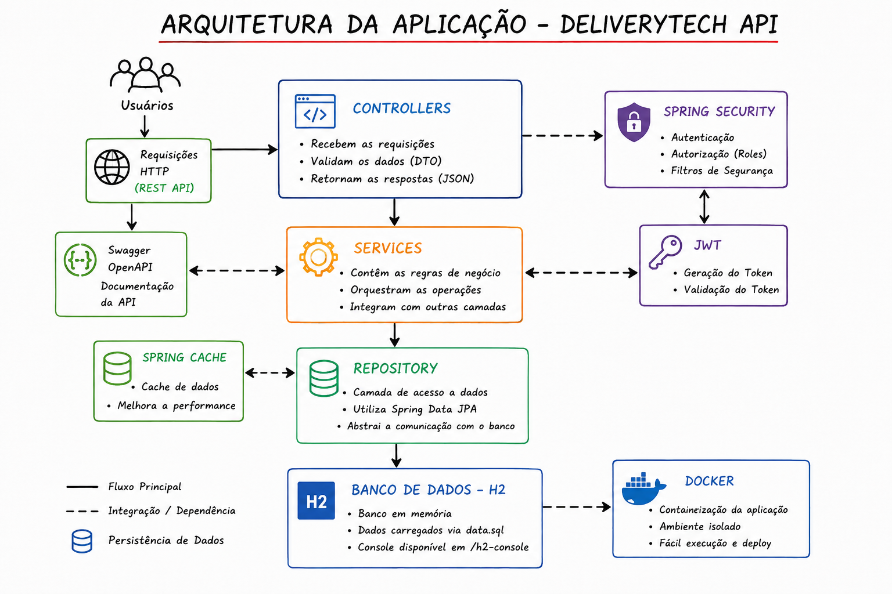
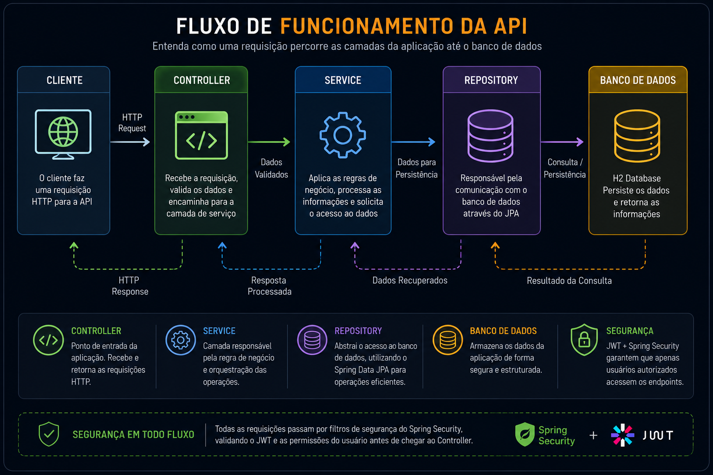

# 📦 DeliveryTech API Backend REST

Projeto desenvolvido com **Java 21** e **Spring Boot 3**, simulando o funcionamento de plataformas modernas de delivery como **iFood**, **Uber Eats** e **Rappi**.

O objetivo é reproduzir uma plataforma completa de delivery, aplicando conceitos modernos de desenvolvimento Backend, arquitetura em camadas, segurança, documentação, testes automatizados, monitoramento e containerização.

---

# 🚀 Visão Geral

<p align="center">
  
</p>

<p align="center">
  Java 21 • Spring Boot 3 • Spring Security • JWT • Docker • Swagger • Maven • JPA • H2 Database
</p>

---

# 📖 Objetivos do Projeto

O DeliveryTech foi desenvolvido como projeto de estudo e portfólio, buscando simular uma aplicação real de mercado.

Durante o desenvolvimento foram aplicados:

- APIs REST com Spring Boot
- Arquitetura em Camadas (Controller, Service, Repository)
- Segurança com Spring Security
- Autenticação com JWT
- Persistência com Spring Data JPA
- Documentação com Swagger/OpenAPI
- Monitoramento com Actuator
- Testes automatizados
- Docker e containerização
- Boas práticas de backend

Também foi usado como laboratório de aprendizado contínuo e evolução de arquitetura.

---

# 🤖 Utilização de Inteligência Artificial

Durante o desenvolvimento, a IA foi utilizada como apoio técnico para:

- Revisão de arquitetura
- Explicação de conceitos do Spring
- Organização de documentação
- Apoio em testes automatizados
- Sugestões de melhorias

Todo código foi estudado, compreendido e validado antes de ser aplicado.

---

# 🏗 Arquitetura da Aplicação

<p align="center">
  
</p>

### Controller
Responsável por receber requisições HTTP e retornar respostas.

### Service
Contém regras de negócio da aplicação.

### Repository
Responsável pela comunicação com o banco de dados.

### Database
Camada de persistência.

---

# 🔄 Fluxo da API

<p align="center">
  
</p>

Representa o fluxo completo:

Cliente → Controller → Service → Repository → Database → Response

---

# 🚀 Funcionalidades

## 🔐 Autenticação e Segurança
- Cadastro de usuários
- Login com JWT
- Geração de token JWT
- Criptografia BCrypt
- Controle de acesso com Roles
- Spring Security

---

## 👤 Clientes
- Cadastro
- Consulta
- Atualização
- Exclusão lógica
- Validação de dados

---

## 🍽 Restaurantes
- Cadastro
- Consulta
- Atualização
- Exclusão lógica
- Taxa de entrega
- Tempo médio

---

## 🍔 Produtos
- Cadastro
- Atualização
- Exclusão
- Associação com restaurantes
- Consulta por restaurante

---

## 🛒 Pedidos
- Criação de pedidos
- Associação de produtos
- Cálculo automático de valor
- Atualização de status

---

## ⚡ Cache
- Spring Cache

---

## 📄 Documentação
- Swagger / OpenAPI

---

## 📈 Monitoramento
- Spring Boot Actuator

---

## 🧪 Testes

- Testes unitários
- Testes de integração
- Testes de segurança
- MockMvc
- Mockito
- JUnit 5

---

# 🧱 Stack Tecnológica

| Categoria | Tecnologia |
|----------|------------|
| Linguagem | Java 21 |
| Framework | Spring Boot 3 |
| Backend | Spring Web |
| Persistência | Spring Data JPA |
| Segurança | Spring Security |
| Autenticação | JWT |
| Criptografia | BCrypt |
| Banco de Dados | H2 Database |
| Cache | Spring Cache |
| Documentação | Swagger / OpenAPI |
| Monitoramento | Spring Boot Actuator |
| Testes | JUnit 5, Mockito, MockMvc |
| Containerização | Docker |
| Orquestração | Docker Compose |
| Build | Maven |

---

# 🗄 Banco de Dados

O projeto utiliza **H2 Database**, permitindo execução rápida sem instalação externa.

Ao iniciar a aplicação, o arquivo `data.sql` popula automaticamente o banco.

Console:
http://localhost:8080/h2-console

---

# ⚙️ Como Executar o Projeto

## Pré-requisitos
- Java 21
- Maven
- Docker (opcional)

---

## 🖥️ Executando Localmente

```bash
git clone https://github.com/TopsideHornet0/deliverytech.git
cd deliverytech
mvn clean install
mvn spring-boot:run

## 🐳 Executando com Docker

docker compose build
docker compose up
docker compose up --build

## 📄 Documentação da API

Após iniciar a aplicação:
http://localhost:8080/swagger-ui/index.html

## 📌 Principais Endpoints

| Método | Endpoint           |
| ------ | ------------------ |
| POST   | /api/auth/register |
| POST   | /api/auth/login    |
| GET    | /api/clientes      |
| GET    | /api/restaurantes  |
| GET    | /api/produtos      |
| POST   | /api/pedidos       |
# 🚧 Futuras Atualizações

- Migração para PostgreSQL
- Integração com Redis para cache avançado
- Mensageria com RabbitMQ
- Upload de imagens para produtos e restaurantes
- Sistema de avaliações e comentários
- Histórico completo de pedidos
- Paginação e filtros avançados
- Dashboard administrativo
- CI/CD automatizado
- Deploy em ambiente cloud (AWS ou similar)

---

# 📚 Documentação Técnica

Este projeto conta com documentação complementar para auxiliar no entendimento da arquitetura e funcionamento da aplicação:

- Estrutura geral da aplicação
- Fluxo completo das requisições
- Sistema de autenticação e autorização (Roles)
- Funcionamento do banco de dados (data.sql)
- Exemplos de requisições e respostas
- Casos de sucesso e erro
- Evolução planejada do sistema

---

# 📂 Arquivos de Documentação

- `docs/Relatorio_Tecnico_DeliveryTech.docx`
- `docs/Relatorio_Tecnico_DeliveryTech.pdf`

---

# 👨‍💻 Desenvolvedor

**João Lucas Silva de Azevedo**

Backend Developer • Java • Spring Boot

📧 Email: joao.azevedoluc@gmail.com  
💼 LinkedIn: https://www.linkedin.com/in/joão-lucas-silva-de-azevedo-784711314/  
🐙 GitHub: https://github.com/TopsideHornet0